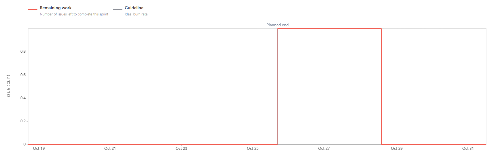
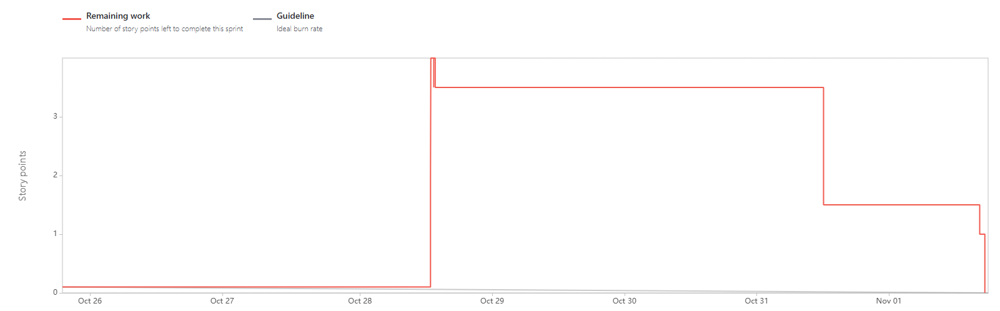
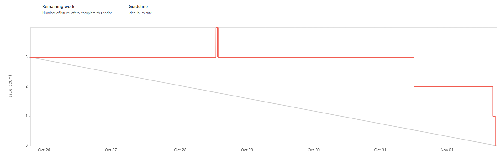
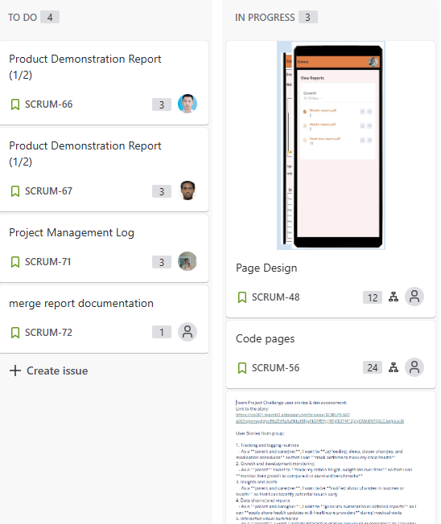

Project Management Discussion

The team has been working collaboratively and cohesively throughout the duration of the project. Members have consistently demonstrated a strong commitment to shared goals, and communication channels have been used effectively to address issues as they arise. The project is progressing on schedule, with milestones being met in a timely manner and deliverables completed to the expected quality standards. However, there have been occasional delays due to unforeseen challenges, which the team has managed through effective problem-solving and resource reallocation.

Scrum meetings, that took place in the assigned labs, have been instrumental in ensuring the team remains aligned. These meetings have generally been productive, though there is potential for improvement. For example, setting stricter time limits for discussions could prevent meetings from overrunning, as we were usually the last to leave. Introducing a shared agenda before each session might also improve focus and allow members to prepare more effectively.

Some minor communication issues were observed, particularly at the start, when we were getting used to tools such as Jira. At times, responses to critical updates were delayed, which impacted decision-making. To mitigate this, the team is considering implementing stricter response-time guidelines or enhancing the use of synchronous communication methods, in particular we used WhatsApp to communicate and agree on what tasks to assign and to who on Jira.

Standup meetings were also utilized, and their effectiveness has been enhanced by tracking discussions in Jira and WhatsApp. This integration allowed the team to revisit key points and maintain accountability. The recorded Jira links provided transparency and served as a reference for tracking unresolved tasks and completed work.

Sprint Burndown Charts

Sprint 1 Burndown Chart

· Standup Meetings: Standup meetings were taken place in person during the assigned labs and their sprint on Jira.

· Key Observations: The team started strong, but mid-sprint challenges led to a temporary dip in productivity. Adjustments to workload allocation helped recover the pace toward the end.

Sprint 3 Burndown Chart

· Standup Meetings Standup meetings were taken place in person during the assigned labs and their sprint on Jira.

· Key Observations: Sprint 3 saw the team achieving near-perfect alignment with the planned scope. Lessons from previous sprints were effectively applied, minimizing disruptions.

Burndown-Charts Discussion

The burndown charts reveal significant insights into the team's performance and planning capabilities. Initial sprints highlighted areas where task estimations were either overly optimistic or pessimistic, leading to deviations from the planned trajectory. By Sprint 3, estimations became more accurate, and the team demonstrated a noticeable improvement in velocity.

To further enhance performance, the team could:

· Implement more detailed task breakdowns during planning sessions to ensure estimates account for potential complexities.

· Use historical data from previous sprints to refine estimation techniques.

· Consider adopting capacity planning tools to better align individual workloads with sprint goals.

Additionally, the team might benefit from regular retrospective meetings during the week to address specific challenges and refine processes. By maintaining open communication and a commitment to continuous improvement, these adjustments should lead to more consistent

burndown progress and a higher likelihood of meeting sprint objectives within the allocated time.

Product Backlog

The product backlog has been maintained in Jira and includes prioritized user stories, epics, and technical tasks. Regular grooming sessions have ensured that the backlog remains up-to-date and aligned with project goals. Dependencies and critical-path items have been flagged to ensure smooth workflow transitions between sprints. Only a few tasks are still remaining to be completed and as of typing, are near completion.

The team has made use of tagging and categorization features within Jira to further streamline backlog management. Tasks have been divided into categories such as "high-priority," "medium-priority," and "low-priority" to better focus efforts during sprint planning. This approach has ensured that the most critical features and functionalities are addressed first, enhancing overall project alignment with stakeholder expectations.

Other Areas

The team has leveraged several advanced project management tools to streamline workflows and improve transparency. Key highlights include:

1. Jira Features:

o Epics and Versions: Comprehensive use of epics and versions to track large-scale project goals and ensure timely deliverables.

o Issue Links: Extensive use of issue links to map dependencies between tasks, ensuring smoother sprint execution.

2. Reporting Graphs:

o Custom Jira dashboards displaying sprint progress, task status distribution, and team workload balance.

o Detailed velocity charts to evaluate team productivity over multiple sprints.

3. Continuous Integration Tools:

o Integration of CI/CD pipelines to automate build and deployment processes.

o Regular use of tools such as Jenkins or GitLab to streamline testing and deployment cycles, reducing the time-to-market for completed features.

4. Team Collaboration Tools:

o Frequent use of WhatsApp for quick updates and team coordination, especially for urgent decisions.

o A shared cloud-based document repository to store project artifacts, making information easily accessible to all team members.

5. Advanced Retrospective Tools:

These tools and techniques have provided valuable insights into team performance and project progress, enabling proactive adjustments to address challenges. Moving forward, the team aims to explore additional integrations and optimizations to further enhance efficiency and collaboration. Expanding the use of advanced analytics and predictive tools could help identify potential risks early, while continued emphasis on teamwork and communication will ensure the project stays on track.