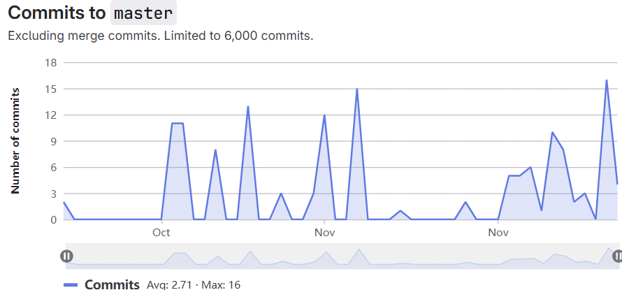
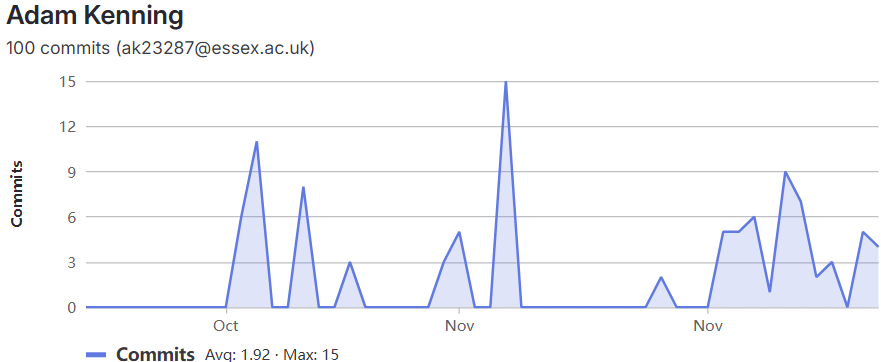
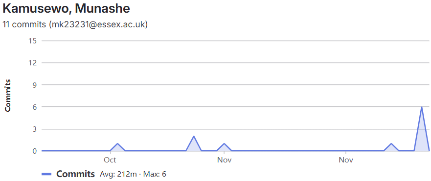
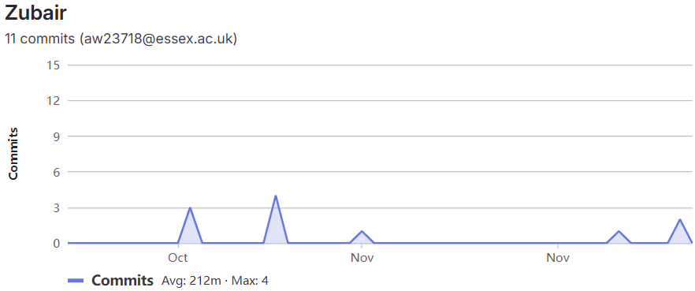
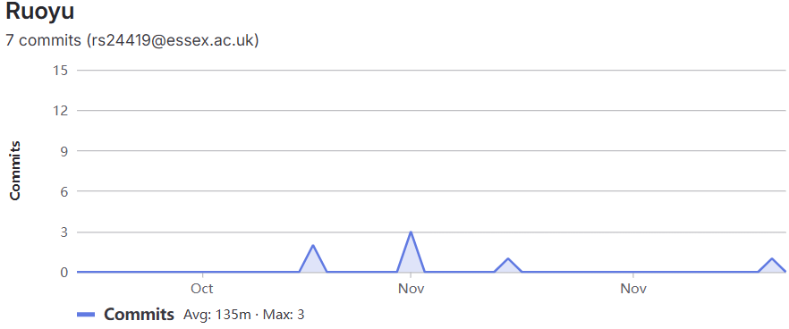
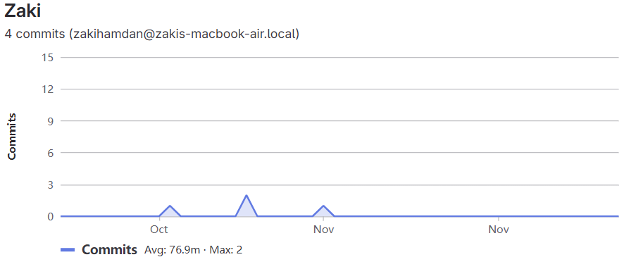
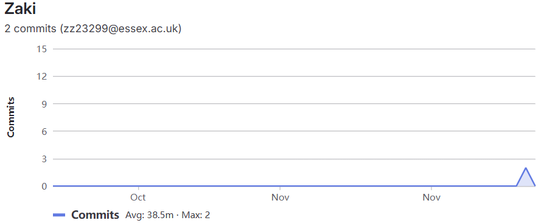
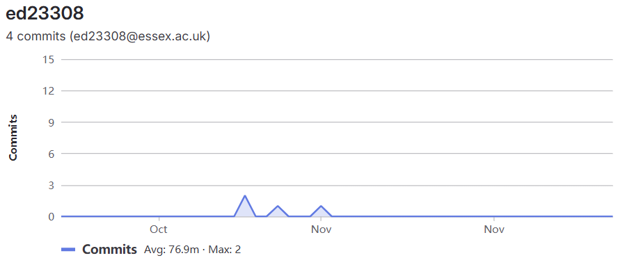

# Contributions
Git (As of 28/11/24 - 13:00)
- Total contribution as a group
  - 155 Commits
  - 
- ak23287 - Adam
  - 100 Commits
  - 
- mk23231 - Munashe
  - 11 Commits
  - 
- aw23718 - Zubair
  - 11 Commits
  - 
- rs24419 - Charles (Ruoyu Sun)
  - 7 Commits
  - 
- zz23299 - Zaki (Committed under two email addresses)
  - 6 Commits
  - 
  - 
- ed23308 - Even
  - 4 Commits
  - 
---
# Team Effort Log
## Team Member : Adam
### Sprint 1 (University Week 3) : Meeting Team
- Introduce and get to know team members : https://ce201-team02.atlassian.net/browse/SCRUM-1
  - Met everyone, introduced each other , talked about the project
### Sprint 2 (University Week 4) : Setting up Git
- Familiarise with command-line CSEEGIT : https://ce201-team02.atlassian.net/browse/SCRUM-4
  - Setup an Intellij repository on my personal local device (via intellij)
- Setup an Intellij repository for Zubair, Zaki (Charles & Munashe had already left, Evan did'nt have a personal laptop to setup on yet)
### Sprint 3 (University Week 5) : Writing User Stories
- Hello World : https://ce201-team02.atlassian.net/browse/SCRUM-12
  - Setup Hello World file
  - Added line containing my name
- True Photos : https://ce201-team02.atlassian.net/browse/SCRUM-18
  - Added profile photo to GitLab & Jira
- User Stories : https://ce201-team02.atlassian.net/browse/SCRUM-26
  - Created User Stories.md
  - Added User stories template
  - Created reference exemplary User stories (including ideas for implementation)
- Java Jframe : https://ce201-team02.atlassian.net/browse/SCRUM-32
  - Created Java application for JFrame (redundant?) including : 
    - ChawtsApp.java : Main Setup, Links data with display
    - ChawtsData.java : Handles the logic and information management in the software
    - ChawtsDisplay.java : Handles presenting software graphically to the user, inputs etc
  - Note : It was agreed on that this was necessary initially but it was later decided we did'nt need it. 
- Setup the repository for Charles
  - Fixed  Zaki & Zubair repository that broke (?)
- Organized a meeting outside of Lab
  - Setup the repository for Evan and Munashe, Who still did'nt have it setup
  - Clean up loose ends uncompleted during prior labs
- Organized plan for structure of four weeks leading up to MVP deadline
  - Research, Mock Up, Coding, Report.
- Reorganized whole project directory into organized folders e.g. ProjectDocuments, ChawtsPackage, SetupTesting etc
### Sprint 4 (University Week 6) : Researching Existing Software
- Research : https://ce201-team02.atlassian.net/browse/SCRUM-38
  - Created Research.MD (For the project files)
  - Created and Shared Page Research File on Google Drive for live editing
    - https://docs.google.com/document/d/1nSDSxrtAWSemUQSc9NKEZ9SeelkroUnpmQviVPMAPfo/edit?usp=sharing
  - Organized how to collaboratively research topics needed together
    - Split the group into three subgroups of two people each
    - Each group of two would research one of Sleep, Growth, Food intake
    - Note : I allowed everyone to pick their research topics and i accepted the last one.
  - Researched General information on sleep & sleep tracking software
  - Researched 3 existing specific exemplary websites
- Refactor user stories : https://ce201-team02.atlassian.net/browse/SCRUM-33
  - Everyone had written their user stories slightly differently
  - Reformatted them into a homogenous collection
  - Removed duplicates
  - Merged similar ones
  - Extract implied required software features
### Sprint 5 (University Week 7) : Creating Graphical Mock up
- Page design : https://ce201-team02.atlassian.net/browse/SCRUM-49
  - Organized how to split up the workload
    - Split website into 6 fundamental pages
    - Each person designs 1 page (Mobile & Desktop)
  - Created laid out and Shared Page Design File on Google Drive for live editing
    - https://docs.google.com/drawings/d/1UGq0MjYq5Gtoi0dJ2RKN296XIFP19lSZOgtvojr--wU/edit?usp=sharing
  - Designed my page
  - Note : I allowed everyone to pick their pages and i accepted the last one.
- Refactor Research : https://ce201-team02.atlassian.net/browse/SCRUM-44
  - Everyone had written their user stories slightly differently
  - Reformatted them into a homogenous collection
- Additional User stories : https://ce201-team02.atlassian.net/browse/SCRUM-47
  - To answer accessibility concerns e.g. Colour blind users, Dyslexia etc
  - To answer security concerns e.g. Data integrity, Anonymity etc
- Refactor User stories (again) : https://ce201-team02.atlassian.net/browse/SCRUM-64
  - There were a lot of user stories 15 + 
  - Merged similar ish ones
  - Deleted redundant ones
  - Now 10 Broad ones
### Sprint 6 (University Week 8) : Website Coding (Html,CSS,etc)
- Code pages : https://ce201-team02.atlassian.net/browse/SCRUM-59
  - Created directory structure (html, css etc folders)
  - Created index.html
  - created shared navigation bar html & css
  - created template html and css files for all other pages ready for everyone else
  - Created home.html and home.css (my allocated page)
  - Note : I allowed everyone to pick their pages and i accepted the last one.
- Unable to attend lab
  - No jira stories were made in my absence
  - No Plans were put into place
  - Created jira stories retrospectively to accommodate
### Sprint 7 (University Week 9) : Report Writing
- Report Setup : https://ce201-team02.atlassian.net/browse/SCRUM-65
  - Created Report folder & subfolders/files
  - Organized how to split up the workload of report writing
  - For each persons section, created exemplary notes as to what needs to be covered and talked about
- Report writing : https://ce201-team02.atlassian.net/browse/SCRUM-70 
  - Wrote my section of the report
  - Note : I allowed everyone to pick their sections and i accepted the last one.
---
## Team Member : Charles
### Sprint 1 (University Week 3) : Meeting Team
- Introduce and get to know team members : https://ce201-team02.atlassian.net/browse/SCRUM-1
### Sprint 2 (University Week 4) : Setting up Git
- Familiarise with command-line CSEEGIT : https://ce201-team02.atlassian.net/browse/SCRUM-9
### Sprint 3 (University Week 5) : Writing User Stories
- Hello World : https://ce201-team02.atlassian.net/browse/SCRUM-16
- True Photos : https://ce201-team02.atlassian.net/browse/SCRUM-23
- User Stories : https://ce201-team02.atlassian.net/browse/SCRUM-30
### Sprint 4 (University Week 6) : Research
- Research : https://ce201-team02.atlassian.net/browse/SCRUM-40
### Sprint 5 (University Week 7) : Creating Graphical Mock up
- Page design : https://ce201-team02.atlassian.net/browse/SCRUM-54
### Sprint 6 (University Week 8) : Website Coding (Html,CSS,etc)
- Code pages : https://ce201-team02.atlassian.net/browse/SCRUM-62
### Sprint 7 (University Week 9) : Report Writing
- Report writing : https://ce201-team02.atlassian.net/browse/SCRUM-66
---
## Team Member : Evan
### Sprint 1 (University Week 3) : Meeting Team
- Introduce and get to know team members : https://ce201-team02.atlassian.net/browse/SCRUM-1
### Sprint 2 (University Week 4) : Setting up Git
- Familiarise with command-line CSEEGIT : https://ce201-team02.atlassian.net/browse/SCRUM-6
### Sprint 3 (University Week 5) : Writing User Stories
- Hello World : https://ce201-team02.atlassian.net/browse/SCRUM-14
- True Photos : https://ce201-team02.atlassian.net/browse/SCRUM-21
- User Stories : https://ce201-team02.atlassian.net/browse/SCRUM-28
### Sprint 4 (University Week 6) : Researching Existing Software
- Research : https://ce201-team02.atlassian.net/browse/SCRUM-37
### Sprint 5 (University Week 7) : Creating Graphical Mock up
- Page design : https://ce201-team02.atlassian.net/browse/SCRUM-52
### Sprint 6 (University Week 8) : Website Coding (Html,CSS,etc)
- Code pages : https://ce201-team02.atlassian.net/browse/SCRUM-61
### Sprint 7 (University Week 9) : Report Writing
- Report writing : https://ce201-team02.atlassian.net/browse/SCRUM-71
---
## Team Member : Munashe
### Sprint 1 (University Week 3) : Meeting Team
- Introduce and get to know team members : https://ce201-team02.atlassian.net/browse/SCRUM-1
After meeting the team i decided to make some sketches based on what the software we were doing would look like, at the time i did not know if we would be doing it through application or doing it web based. i had a couple of ideas based on the cleint summary and requirements for the project. i had a homepage a growth tracker page and a slepp tracking page.
### Sprint 2 (University Week 4) : Setting up Git
- Familiarise with command-line CSEEGIT : https://ce201-team02.atlassian.net/browse/SCRUM-7
For this sprint we had to setup GitLab and visual studio code so that we can work together collaboratively. we used visual studio code ide so that we could work together and make changes and commit them so that it is updated everywhere. there was a video that we had to watch but following some of the instructions didnt work becasue our software was different.
### Sprint 3 (University Week 5) : Writing User Stories
- Hello World : https://ce201-team02.atlassian.net/browse/SCRUM-15
- True Photos : https://ce201-team02.atlassian.net/browse/SCRUM-22
- User Stories : https://ce201-team02.atlassian.net/browse/SCRUM-29
here i made user stories for what users would expect from this website. i quite of few. we also were meant to upload our photos to our profiles to help other team members know who we are.
### Sprint 4 (University Week 6) : Researching Existing Software
- Research : https://ce201-team02.atlassian.net/browse/SCRUM-42
for this one i looked at 3 web papges that were based on the page type that i was given, i had the growth page so i looked at multiplpe different websites to get an idea of the things that other websites had like features layouts etc, and i wrote about what i liked about them and what i didnt like etc.
### Sprint 5 (University Week 7) : Creating Graphical Mock up
- Page design : https://ce201-team02.atlassian.net/browse/SCRUM-53
for this one it was the first page that i made i used html and css but nothing on the page worked, it was just to see if i could implment the sesigns that i made in mockflow to an actual page and i think that the designs turned out to be ok.
- Page design also : https://ce201-team02.atlassian.net/browse/SCRUM-55
for this one this is where all the designs that i made are, i looked at the research that i did and implemented the things that i like from those pages, such as bright colours imagery and keep things simple. but for my final design it was to keep in cohesion with the other designs that other group members made so i went for something that was less colourful.
### Sprint 6 (University Week 8) : Website Coding (Html,CSS,etc) + documenation + future Changes
- Code pages : https://ce201-team02.atlassian.net/browse/SCRUM-62
on here i documented the work that i did and showed screenshots of development and changes the i would like to make in the future, such as making the graph work and changing the colour scheme etc.
### Sprint 7 (University Week 9) : Report Writing + team effort + project management log
- Report writing : https://ce201-team02.atlassian.net/browse/SCRUM-69
for the report writing i was given the requirements and risk assessment, i used the user stories that everyone made instead of the one i made by myself. in this sprint i also added my team effort log an project management log that was meant for every member to do.

---

## Team Member : Zaki
### Sprint 1 (University Week 3) : Meeting Team
- Introduce and get to know team members : https://ce201-team02.atlassian.net/browse/SCRUM-1
### Sprint 2 (University Week 4) : Setting up Git
- Familiarise with command-line CSEEGIT : https://ce201-team02.atlassian.net/browse/SCRUM-8
### Sprint 3 (University Week 5) : Writing User Stories
- Hello World : https://ce201-team02.atlassian.net/browse/SCRUM-17
- True Photos : https://ce201-team02.atlassian.net/browse/SCRUM-24
- User Stories : https://ce201-team02.atlassian.net/browse/SCRUM-31
### Sprint 4 (University Week 6) : Researching Existing Software
- Research : https://ce201-team02.atlassian.net/browse/SCRUM-39
### Sprint 5 (University Week 7) : Creating Graphical Mock up
- Page design : https://ce201-team02.atlassian.net/browse/SCRUM-51
### Sprint 6 (University Week 8) : Website Coding (Html,CSS,etc)
- Code pages : https://ce201-team02.atlassian.net/browse/SCRUM-60
### Sprint 7 (University Week 9) : Report Writing
- Report writing : https://ce201-team02.atlassian.net/browse/SCRUM-67
---
## Team Member : Zubair
### Sprint 1 (University Week 3) : Meeting Team
- Introduce and get to know team members : https://ce201-team02.atlassian.net/browse/SCRUM-1
### Sprint 2 (University Week 4) : Setting up Git
- Familiarise with command-line CSEEGIT : https://ce201-team02.atlassian.net/browse/SCRUM-5
### Sprint 3 (University Week 5) : Writing User Stories
- Hello World : https://ce201-team02.atlassian.net/browse/SCRUM-13
- True Photos : https://ce201-team02.atlassian.net/browse/SCRUM-20
- User Stories : https://ce201-team02.atlassian.net/browse/SCRUM-27
### Sprint 4 (University Week 6) : Researching Existing Software
- Research : https://ce201-team02.atlassian.net/browse/SCRUM-41
### Sprint 5 (University Week 7) : Creating Graphical Mock up
- Page design : https://ce201-team02.atlassian.net/browse/SCRUM-50
### Sprint 6 (University Week 8) : Website Coding (Html,CSS,etc)
- Code pages : https://ce201-team02.atlassian.net/browse/SCRUM-73
### Sprint 7 (University Week 9) : Report Writing
- Report writing : https://ce201-team02.atlassian.net/browse/SCRUM-68