# Research
- Research Doc : https://docs.google.com/document/d/1nSDSxrtAWSemUQSc9NKEZ9SeelkroUnpmQviVPMAPfo/edit?tab=t.0
## Sleep
### Adam
#### App 1 : Sleep Cycle
##### 1. Images
- 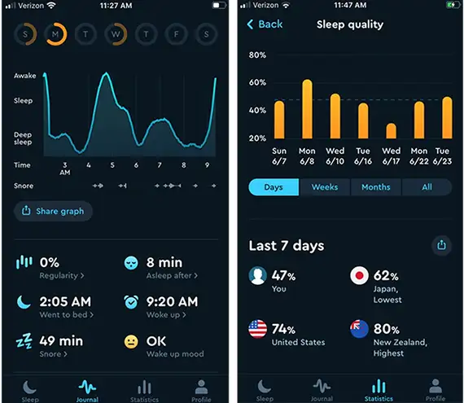
- 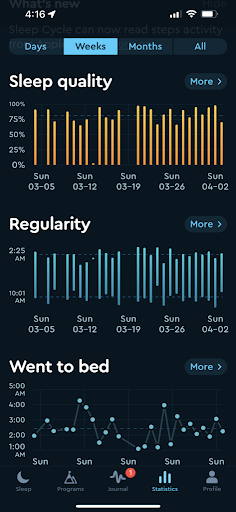
##### 2. Features
- Sleep tracking & Recording
  - Listen back on recordings of snoring, sleep talking and other sounds
  - Snore tracking, marked specifically on graph
  - Allows for note taking / journaling of specific sleeps
- Sleep Analysis / Insights
  - Details what effects users sleep quality
  - Details how users sleep quality changes over time
  - Provides daily insights
  - Tailored sleep advice
- Alarm tuned to personal sleep cycle
  - Gradual alarm that builds up during lightest sleep phase
  - Permits waking up without startling alarm
  - Permits waking up without feeling groggy
- Sleeping Aids
  - Provides soothing music
  - Provides relaxing ambient sounds (e.g. Rain)
  - provides guided meditations(?)
##### 3. Design
- Colours
  - Primary colour : Dark warm blue
  - Secondary colour : Warm orange
  - Colours mimic colours of a sunset over an an ocean
    - Provides a relaxing user experience
  - Colours are warm and overall dark
    - Allows for an easy viewing in dark conditions (fits with the sleep theme)
  - Colours are colour wheel opposites
    - Provides contrast to easy see elements on the app
  - Most other colours used are shades of these two colours
    - e.g. Graphs are lighter shades of blue
    - Makes the app feel homogenous 
  - Any other colours are used sparingly but make sense when used
    - e.g. Red used for a small heart icon
- Layout
  - The app has four primary pages
    - Sleep
      - Landing page of the app
      - Minimal Layout with bare necessary info
      - Morning wake up selection time 
      - Start button
    - Journal
      - Export button to share with others
      - Raw information on selected day (current, yesterday etc)
      - Time vs Sleep stage (Awake, Sleeping, Deep sleep) Graph
        - Marked with snoring periods
      - Quality of sleep
        - % score out of 100
      - Total time asleep
        - Time went went to bed
        - Time Woke up
      - Total time in bed
        - Time after going to bed, you went to sleep
      - Time spent snoring 
    - Statistics
      - Bar graph of Sleep quality against Day (last week)
      - Compare your personal sleep score against country averages
        - Compare last week, month and all time
        - Compare against country with lowest average
        - compare against country with highest average
        - compare against local country (?) 
    - Profile
      - Total amount of nights recorded
      - Average sleep quality (last x amount of time)
      - Average hours of sleep
      - Icon showing everything is backed up (yes/no)
      - Access to settings
  - Navigation
    - A horizontal navigation bar is present at the bottom of the screen
    - Navigation bar includes Icons for the pages as well as page names
    - The current page the user is on is highlighted
    - Users can tap or swipe (left/right) to change the page
  - Pages are roughly equally balanced with amount of information on each page
##### 4. Misc 
- Popularity
  - 4.7 Stars
  - 50+ Million users
  - "Editors choice" in Apple store
#### App 2 : Snore Lab
##### 1. Images
- 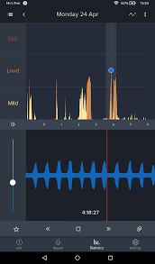
- 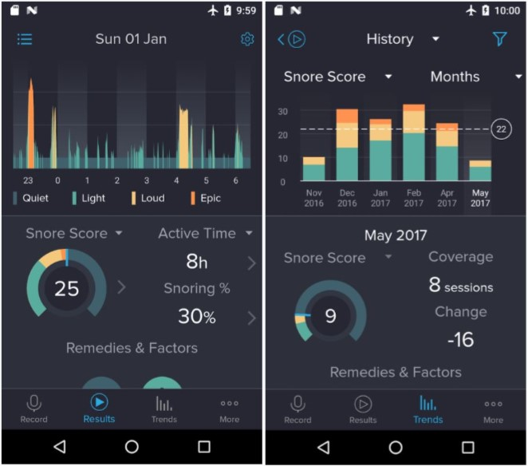
##### 2. Features
- Snore recording
  - Listen to playbacks of snoring samples throughout the night
  - Option to record only snores / whole night for data saving
- Snore analysis
  - Measurements of snoring intensity
  - Measurements of snoring duration
  - "Snore Score" - lower score = better
- Snoring insights
  - Contained information on snoring remedy options
  - Contained information on typical factors affecting snoring
- Compare personal snoring overtime
  - Evaluate effectiveness of different applied solutions
  - Evaluate effectiveness of lifestyle changes
##### 3. Design
- Colours
  - Primary colour : Dark gray / blue ? 
  - Secondary colour : colours in the range orange - green
  - In the middle of cool and warm tones
  - For the most part the app supports a dark theme which lowers strain on the eyes during viewing in low light levels
  - Secondary colour is used to represent "goodness" in certain elements
    - i.e. The secondary colour being more green means better etc
  - All other colours are shades of the primary colour which makes the app feel homogenous
- Layout
  - Five primary pages
    - Record
      - A minimal page with 5 key parts
        - A start button to let the app know you're going to sleep
        - A timer indicating how long until you are scheduled to go to bed
        - 3 quick navigation buttons to results, remedies, factors
        - This page is likely the landing page of the app too
    - Results
      - Results given for each specific day7
      - Time against Loudness graph of snoring
        - Four categories of loudness (Quiet, Light, Loud, Epic)
        - Each category tells you how long you spent in it
          - "how long you were snoring x loudly"
      - Sound graph at the bottom for directly playing back sound
        - Slider to change volume of playback
        - buttons pause, forward/backward skip like a remote
      - Sound graph time is mapped onto graph to quickly see when in the night you are listening to a playback of
    - Trends
      - Top second sub navigation bar to switch between different likely effect groups effecting sleep quality
        - Weight, Happiness, Factors, Remedies
      - Bar chart of Sleep score against different items in the effect group
        - E.g. If "Factors" was selected, a bar chart of Sleep quality against Exercise, Medication, Cleanliness etc will be shown
      - The page allows the user to quickly assess what may be causing an increase (or decrease) in their snoring / general sleep quality
      - It notes the amount of times each factor has been recorded while sleeping
      - It tells user the average sleep quality during that factor as well as the difference in sleep qualities against other factors
    - Insights
      - A directory of sorts that provides general information about sleep scores and what effects it
      - The page includes a subheading of relevant articles for the user such as external links to blogposts by sleep professionals
      - The page provides some key notes as to simple lifestyle changes the user could make to benefit their sleep as well as suggests further reading like the aforementioned blogs and posts 
    - Profile
      - The default profile editor page for the application 
      - Allows for editing of user settings such as Weight, Height etc
      - Allows for access to the core settings of the application of the website too 
      - provides the user with a brief overview/ summary of the key characteristics of their persona sleep
  - Navigation
    - Similar horizontal bar present at bottom of screen
    - Achieved by tapping between them
    - Similar Icon + Page text present of each page
##### 4. Popularity
- "millions of people" (users)
- "No.1 IOS and Android app"
#### App 3 : Sleep Wave
##### 1. Images
- 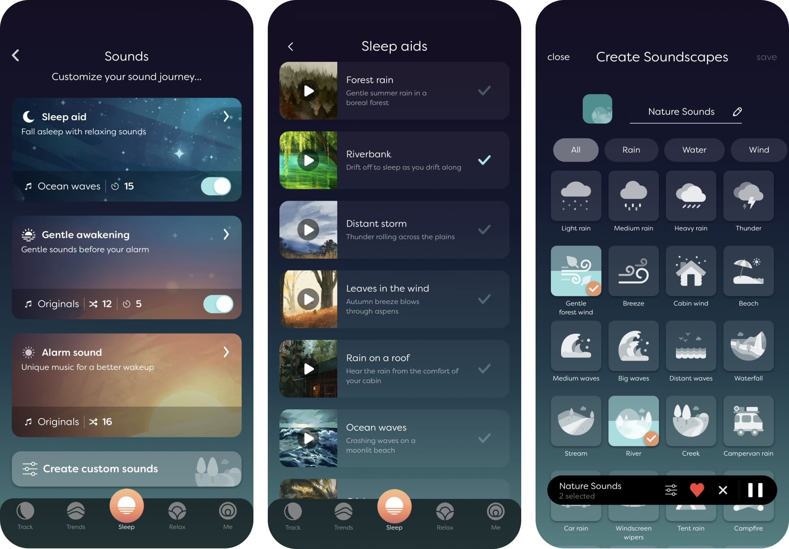
- 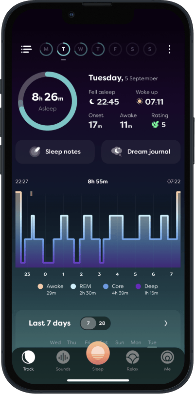
##### 2. Features
- Smart alarm
  - Uses the body motion sensing feature
  - Determines (using some algorithm) The optimal time to wake the user up
  - Wakes up the user in a 15 minute window 
- Body motion sensing
  - Using available motion sensors provided by the mobile device the app is installed on 
- Breathing sensing
  - Using normal microphones the phone has installed on the device 
- Sleep tracking app
  - Uses the two fundamental sensing types the app has available ; Motion & breathing
  - Can determine the onset time of sleep
  - Can determine the sleep depth (how deep of a sleep the sleep was ?)
  - Can determine the "wakefulness" of the sleep the user just had (For how long during the sleep the user was actually awake for not asleep)
  - Can determine the "breathing rate" of the user ? if the users was breathing heavily or shallowly and the frequency etc
- Provides the user with a few "relaxing wave-visuals"
  - Funky visualisations that respond to the users movements  
- Allows for the user to keep a personal journal of their dreams
  - Determine what dreams are associated with what patterns during sleep
- Custom sleep music 
  - A collections of relaxing sounds to help the user fall asleep 
  - Such as nature sounds e.g. Rainfall
  - Similar relaxing sounds can be set as the alarm clock sound for the application
- Integration with the apple watch and other electric watches that support either IOS or Android
##### 3. Design
- Colours
  - Primary colour : Warm dark midnight blue
  - Secondary colour : Pale washed light orange
  - Tertiary colour : Cool vibrant teal blueish tone
  - Similarly to the other apps mentioned, this app favours the a dark mode to reduce eye strain to the user during low light level environments
  - The app makes heavy use of gradients throughout the app
    - The background on every page is a gradient from light to dark
    - The graphs typically are gradients from top to bottom
    - The Central navigation bar has minor gradients on it from light to dark (when unselected)
  - The tertiary colour is used predominantly as a secondary colour to the primary colour
    - It is used in graphical presentations of data to the user such as graphs
    - It is also used to display some information such as mini arrows to help the user navigate
    - The colour is similar enough that it is homogeneous with it and complements it while remaining different enough to "pop" from the page to the user
  - The Actual secondary colour is predominantly used to draw the attention of the user onto important information on the page
    - Such as the currently selected page for the navigation bar
    - Such as later buttons for key things e.g. "Start recording"
- Layout
  - The app has 5 main pages which are navigated with a bottom navigation bar
    - Track
      - The primary means the user can view their data and assess their sleeping patterns
      - In the tertiary colour is used heavily on this page to display various graphical data representations uch as graphs and pie charts to the user
        - Pie chart quickly shows the user the amount of hours the user slept for that night
        - The graph is sleep "depth" against hour in the night, "depth" referring to the key sleep stages (e.g. awake, light sleep, deep sleep etc)
          - Below it lists the total amount of time in each stage of sleep
    - Sounds
      - Uses the same custom sounds that its creators other app uses
      - A mix of relaxing ambient sounds both natural e.g. rainfall, and non natural sounds e.g. low frequency humming 
    - Sleep
      - The landing page of the application
      - Allows for setting the wakeup time for the user : the alarm clock
      - displays links to the both the settings page and another page
      - Displays information about the wakeup window (start - end) that the user is selecting
      - Displays a big "sleep" button in the secondary colour
        - This button begins the tracking software, from pressing the button it is assumed that the user would be asleep and the logging of information begins
    - Relax
    - Me
      - A similar profile page for the application similar to the other applications with relevant information about the user available for the user sto both see and edit 
      - Provides a brief synopsis of the users sleeping habits and external links to the applications website for further profile editing
        - Such as profile deletion
        - Such as export personal data to CSV
      - General settings such as alarm sounds, bedtime reminders
  - Navigation
    - The navigation bar icons are more abstract than previously seen icons for the navigation bars used in the other apps
      - For instance "me" is two circles, one within the other
      - For instance "relax" appears to be a circle with two adjacent circles overlapping it
    - The centre button on the navigation bar "Sleep" is constantly the one highlighted in the apps tertiary colour no matter what page you visit
    - On visiting another page, the icon for that page gets lighter in shade but its actual colour remains the same
    - Navigation via swiping is available but only when swiping on the navigation bar itself
      - Swiping on the pages itself is reserved for other functions that the individual pages provide to the user
    - Tapping on the icons for the different pages on the navigation bar is also allowed
##### 4. Popularity
- Averages 5 star reviews
- "Best rated alarm app" - App store
- Same creators as Snore Lab
---
### Evan
#### Apps
##### Pokémon Sleep
- Tracks sleep duration and categorises it into stages—dozing Snoozing, and Slumbering. It then scores sleep based on duration and consistency.
- The app features smart alarms, which allow users to awaken during the ‘shallow sleep’ phase of sleep and feel more refreshed upon awakening.
- Apart from Nintendo’s other app – Pokémon GO – there is no integration with other apps, let alone another health app.
- Its very nature is gamified – rewarding its users based on positive sleep habits.
- It is free to use and available on both IOS and Android.
##### Sleep Cycle
- This app monitors sleep patterns, allowing for a deep sleep analysis and trend over time.
- The app utilises a smart alarm feature to wake its users during the lightest sleep phase within a set window.
- On IOS, integration with Apple Health allows a more holistic view of health metrics.
- Has no gamification features.
- Is available on both IOS and Android.
- There is a free version of the app with basic features but to get the better, more advanced features requires a subscription.
##### Pillow
- Analyses sleep cycles, including REM, light, and deep sleep stages, allowing for comprehensive sleep reports.
- Includes a smart alarm akin to the previous apps mentioned – allowing for a gentle wake-up experience.
- Like the sleep cycle app – on IOS – allows integration with Apple Health to offer heart rate analysis during sleep.
- No gamification.
- Only for IOS..
- Free version available – locks the most useful and advanced reports behind a paywall.
##### Whoop
- Offers in-depth sleep analysis, including sleep stages, and disturbances, and tracks sleep debt – allowing the app to provide personalised sleep performance insights.
- Does not offer a smart alarm feature.
- While it doesn't integrate with another app – WHOOP offers a lot of the benefits of integration with Apple Health internally.
- No gamification.
- Available on IOS and Android.
- Requires a subscription to use and a wearable device
---
## Growth
### Munashe
#### more than height
- Misc Info
  - Link: https://v2.morethanheight.com/en/calculator-charts/
  - Date accessed: 07/11/2024
- Screenshot
  - 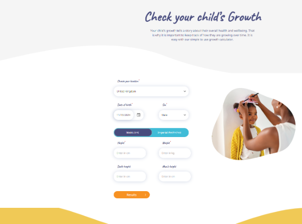
- Purpose
  - In this website the purpose is to help the parent understand what their child's weight and height should be. When you go on the site you can enter the weight and height of the child first and then after that you enter both dads height and mums height.
    - Example:
      - 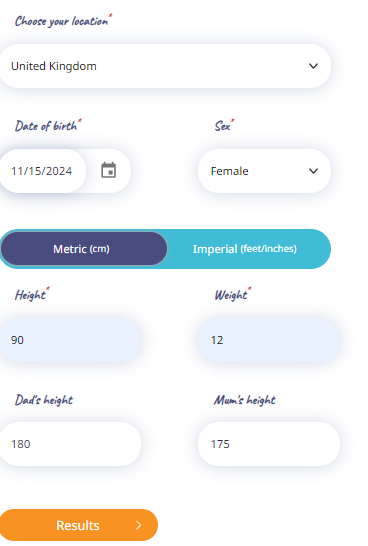
  - Once you then enter the information you can then click on the results:
    - 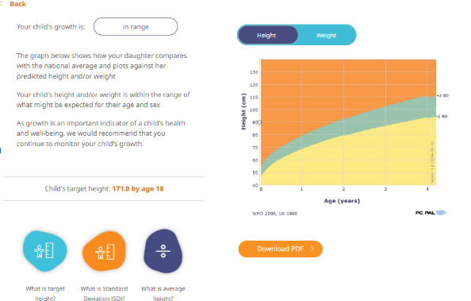
    - Here based on the information that the user provided it will use averages in that country where the parents are the same height as the ones you entered. It will say what the child's height could be by the time that they are 18.
    - It also gives you a graph for their height and their weight.
  - The target audiences for this website are parents healthcare providers and educators. But i think it is mainly for parents, because they would be interested in knowing what their child's weight and height should be compared to the averages.
- Design
  - I Think that the website is easy to navigate, it has got a lot of colour which is good because it knows that it is a website that is meant for children. It is also straight forward in what the website is about here is a screenshot:
    - 
    - 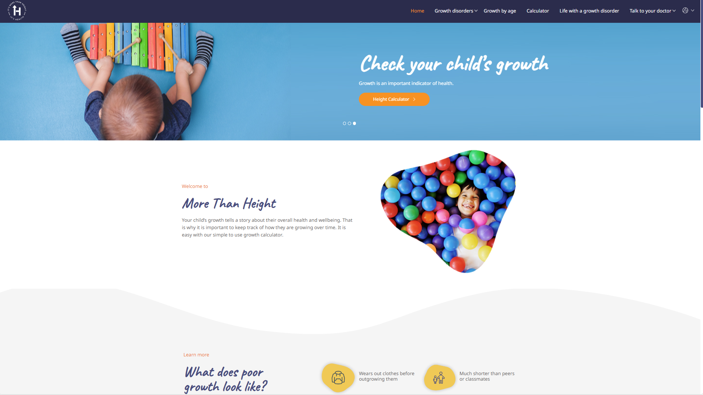
    - 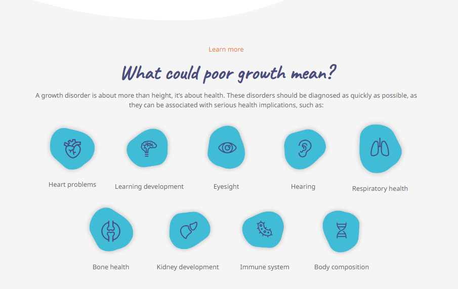
  - It uses a lot of imagery and there aren't long paragraphs on the page it keeps simple for the users. With regards to accessibility I think that is where improvements can be made to the website, it has got a contrasted background which is good however the text on the would be quite difficult for people with bad eyesight because the text on the page is small.
  - Overall i think that this website is good, it knows what people are going to the website to look for and how to make the process for it simple. It is bright and colourful  and welcoming which is great because the site was made for people with children
  - What i can learn from this website is that when i am making my designs i should make them simple and use imagery so that it is nice to look at and simple to follow. And use minimal text to make it easier for users. I could also use a graph to represent the child growth as well.
#### Child Growth Tracker
- Misc Info
  - Link: https://play.google.com/store/apps/details?id=com.abqappsource.childgrowthtracker&gl=GB
  - Date accessed: 07/11/2024
- Purpose
  - The purpose of this website, is to give parents a way to track and observe their children's growth and development.
  - The target audience for this is the parents, healthcare providers and caregivers.
  - The app looks modern and quite simple when you first open the app it greets you with an option to add a child:
  - Here the user can enter in a date and the information about the child such as weight height and head size.
    - 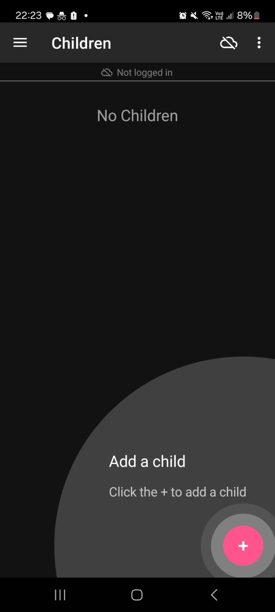
    - 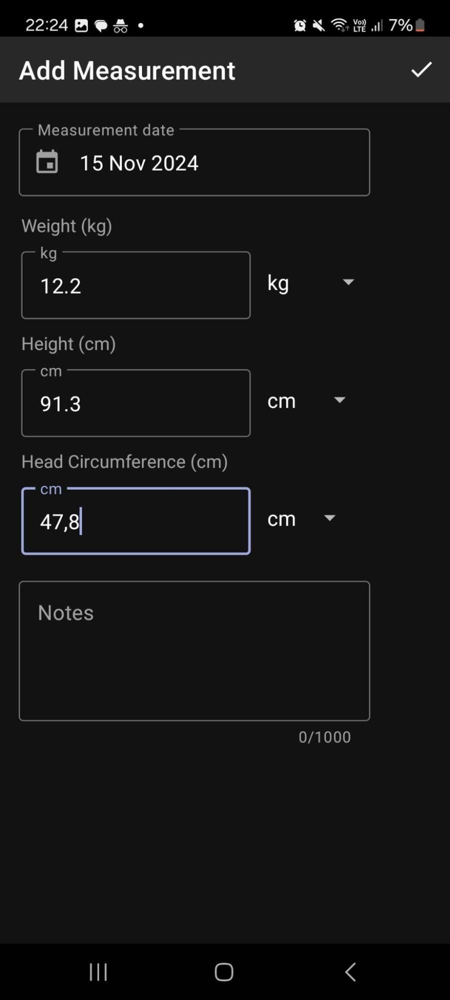
  - This is where the user can view their children:
    - 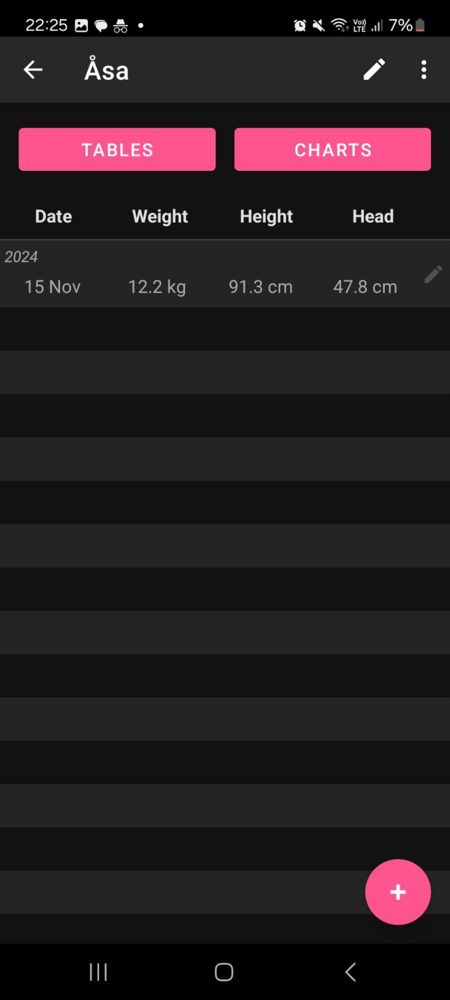
  - Here the user can look at the summary for their child:
    - 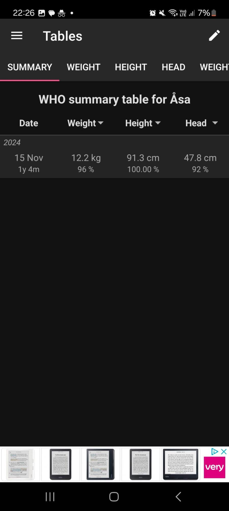
  - Here the user can look at the childs: Height, weight, height/weight and their BMI in a line graph form, giving them averages and percentages overtime.
    - 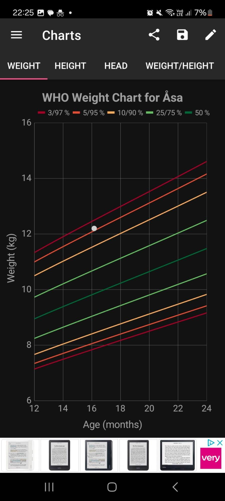
    - 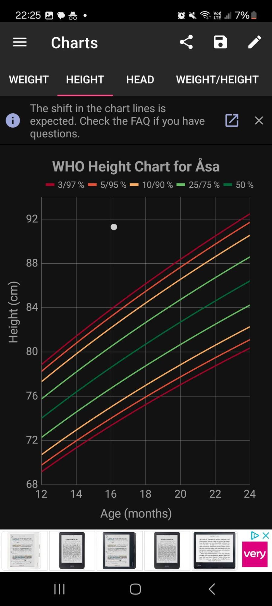
    - 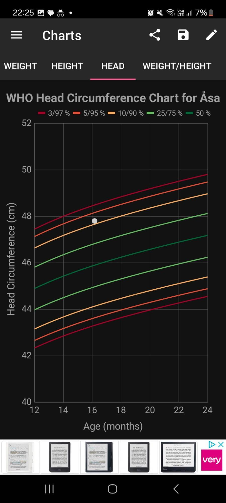
    - 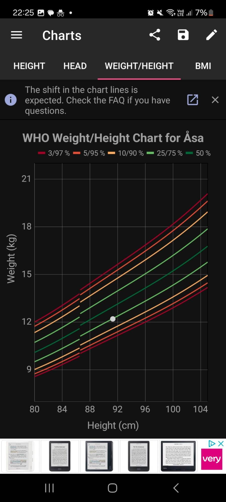
    - 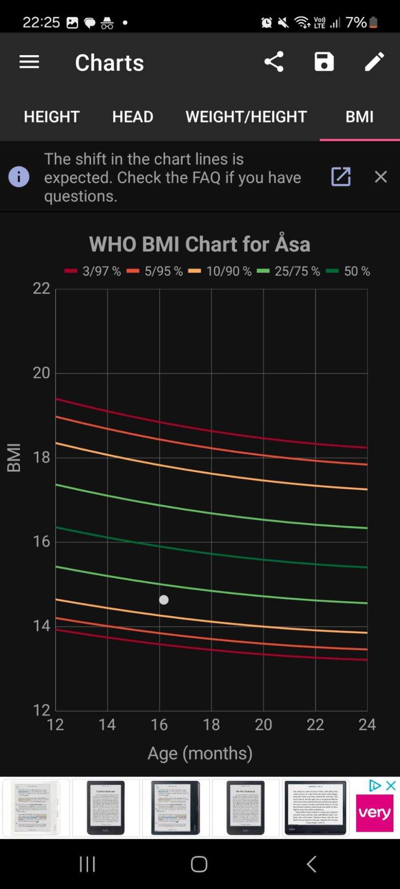
- Design
  - This website looks modern, but it isn't nice to look at compared to the previous example that i used, it uses dark colours and sometimes uses grey text with black background which is bad for accessibility because the background is black which makes it hard to read. It doesnt use much imagery, the app is quite bland but also straight to the point.
  - It is quite simple to navigate on the website however there is a sidebar where you can view all of the features there.
  - When it comes to the information i think that it is good, it gives that parent many data points to look at based on their child, and it is in graph form which is good and afterwards the user can save their graphs or share them with a healthcare provider caregiver or other parent but  the graph can be quite difficult to understand.
  - What I learned from this website is that using colour and imagery is important to make the app look appealing to users and to make the graphs that you are showing simple to read and understand, for this website they could have added an explanation of what the graph is showing etc.
#### the parentZ 
- Misc Info
  - Link: https://play.google.com/store/apps/details?id=com.abqappsource.childgrowthtracker&gl=GB
  - Date accessed: 07/11/2024
- Purpose
  - In this website the purpose is to help the parent understand what their child's weight and height should be. When you go on the site you can enter the weight and height of the child first and then after that you enter both dads height and mum's height.
  - This website is different from other websites that i viewed before it's an all in one app it tracks alot about the baby's development such as feeding sleep diapers, changing medicine etc. when you go on the site you can enter in details about the baby as you can on the other apps.
  - Here you can enter in details about the child's growth, such as date and time, the weight,height and the head size.
    - 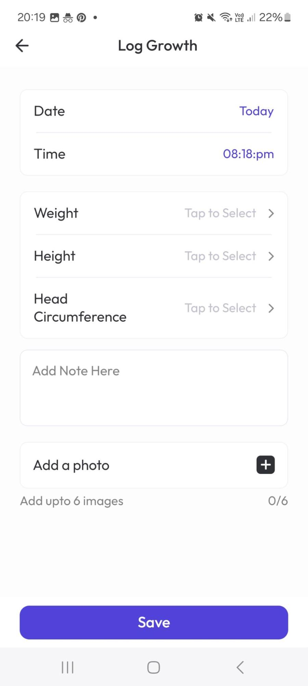
  - Once you have entered in the details about your child it will then put the information in a summary tab, where you can view the information over time:
    - 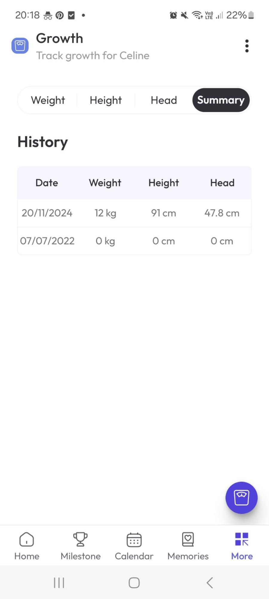
  - There is also another tab where you can look at the weight height and head size of the child compared to the average and predict how the child will grow in the future:
    - 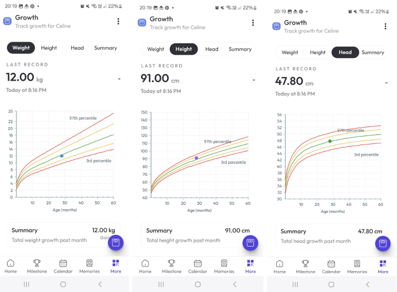
  - The target audiences for this website are parents, healthcare providers and educators. But I think it is mainly for parents, because they would be interested in knowing what their child's weight and height should be compared to the averages.
  - The target for this app is for parents/caregivers that would like to keep track of a variety of things for the child like growth, sleep time and food intake on the homepage these are the different tabs that are there:
    - 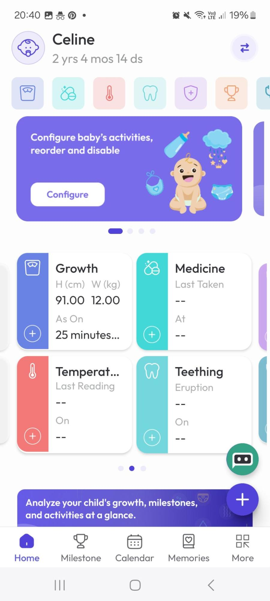
    - 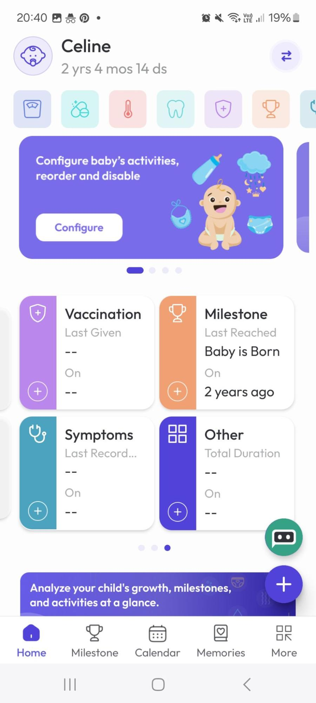
- Design
  - The design here is bright and colourful, it uses a lot of imagery and has a good use of icons for the different tabs like for temperature it uses a thermometer icon and for the symptoms tab it uses a stethoscope. 
  - Out of all the sights i looked at here i think this one is my most favourite and i would like to uses some of the stuff used here and incorporate them into my own designs, such as the use of images and icons. And making the navigation of the app simple and easy. 
---
### Zubair
#### App 1
---
## Food
### Charles
#### App 1
- Children's calorie needs vary with age and activity (proteins and serving sizes) good table
- https://www.healthychildren.org/English/healthy-living/nutrition/Pages/Portions-and-Serving-Sizes.aspx

#### App 2
- Some specific information on dietary guidelines for children ages 1 - 3 years and 4-18 years
- https://cpr.heart.org/en/healthy-living/healthy-eating/eat-smart/nutrition-basics/dietary-recommendations-for-healthy-children

#### App 3
- some advices for parents on diets or child-size protein
- https://www.nhs.uk/live-well/healthy-weight/childrens-weight/healthy-weight-children-advice-for-parents/

---
### Zaki
#### App 1
- https://caloriecontrol.org/healthy-weight-tool-kit/food-calorie-calculator/
---