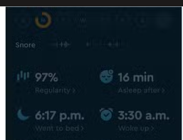
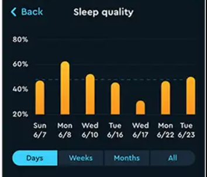
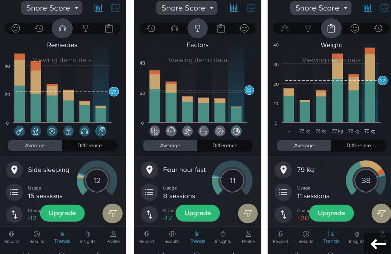
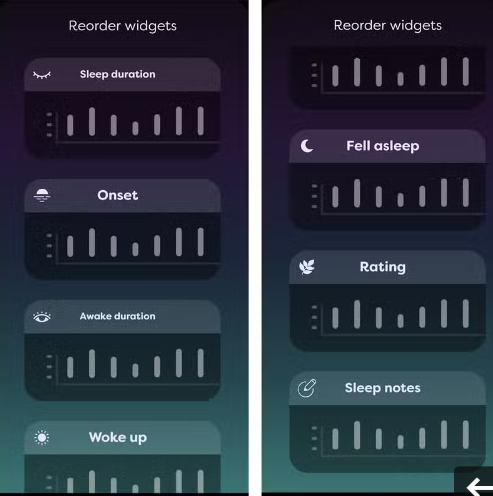
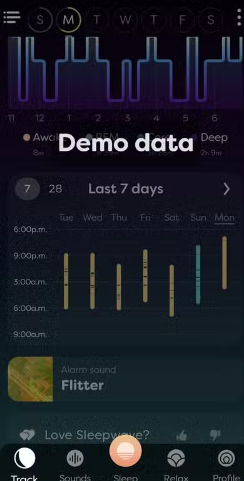

# Research
## Sleep
### Adam
#### General Notes
- Metrics = Min/Hours
- App design ? - https://dribbble.com/tags/sleep-tracker
- Measure a child particular sleep cycle
- Display
    - Most software is only available via mobile
    - Mobile is typically always at hand when you need it
    - Prioritize mobile display for app
- Input
    - Most apps use audio recorders and analyze that LIVE
    - That is hard
    - We could possibly allow for analysing of an MP3 file or something
    - Client side processing (for privacy & network costs)
- Navigation
    - Button navigation
        - Open new windows / pages
        - Back button to navigate
        - Easier to implement
### Sleep Cycle
- Assess sleep regularity (?)
    - 
    - Possibly factoring in intended bedtime / wake time
- Assesses sleep quality
    - 
- Other remarks
    - Pretty colours
    - Easy to read font
    - Bit cluttered
### Snore Lab
- Ability to compare snoring
    - 
    - Though we could implement similar to compare sleep
    - compare different time frames of sleep from different periods
        - categorize them
- Other remarks
    - Scrollable Carousel
        - Harder to implement
        - More intuitive / easier
        - Home page with this ? and extra info with other type ?
    - Colours still nice, not as pretty
        - Looks easier to implement with CSS
### SleepWave: Smart Alarm Clock
- Simple quick accessible categorized info
    - 
- Clearly defined widgets
    - We wont make widgets most likely
    - But similar ideas can be applied for PDF export
- Day by day sleep amount shown (middle of the page)
    - 
    - Coloured based on quality ?
    - Mix readable info with colour info for less clutter
    - Accessibility for colour blind & impairment
