# Child Health and Well-Being Tracking Software - Product Demonstration Report

## Introduction
The **Child Health and Well-Being Tracking Software** is designed to assist parents and caregivers in monitoring a child's growth, health, and daily activities. It provides data-driven insights into essential routines such as sleep patterns, feeding habits, medication schedules, and growth metrics. The software generates visual representations of the child’s progress and allows for PDF reports that can be shared with healthcare providers.

## Features Overview
- **User Authentication:** Secure login and signup functionality.
- **Dashboard:** Provides an overview of a child’s health and activity data.
- **Data Visualization:** Interactive graphs for logs per child and logs per category.
- **Child Selection:** Allows users to track multiple children.
- **Data Export:** Generates reports in PDF format for consultations.
- **Password Recovery:** Users can reset their password via email.
- **Food Tracking:** Logs meal times and calorie intake.
- **Growth Tracking:** Logs child's height, weight, and head circumference with graphical representations.
- **Medication Tracking:** Users can log and monitor their child's medication schedules.
- **Sleep Monitoring:** Tracks sleep duration and quality.
- **Settings Panel:** Allows users to manage account settings, appearance, and security.
- **Change Password:** Allows users to update their password securely.
- **Import/Export Data:** Users can import child profiles and export data.

---

## User Interface Screenshots and Workflow

### 1. **Login Page**
Upon launching the application, users are presented with the login page where they enter their credentials.

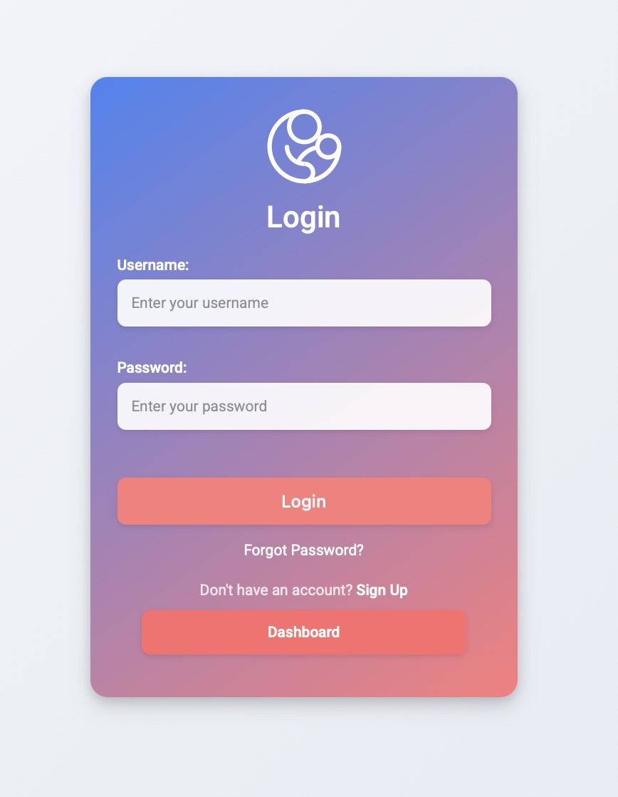

If the user forgets their password, they can click on **'Forgot Password?'** to reset it.

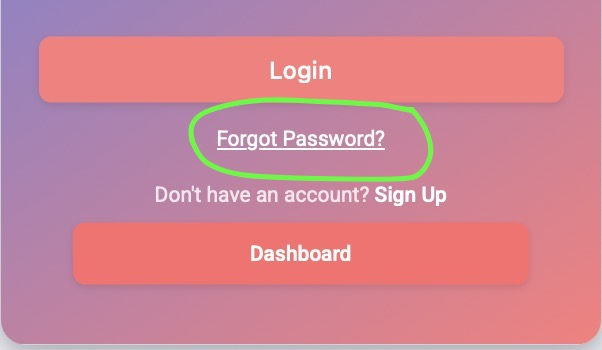

---

### 2. **Sign-Up Page**
New users can create an account by entering their details on the sign-up page.

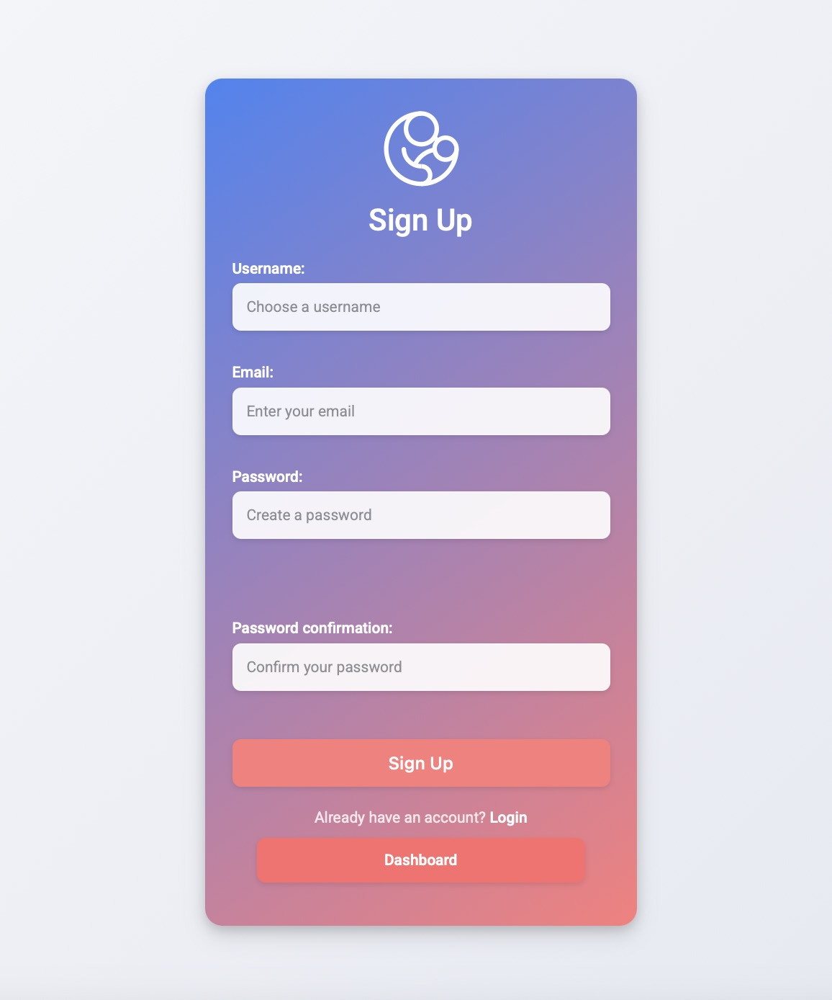

---

### 3. **Dashboard (Guest View)**
When an unregistered user visits the platform, they can view example data.

.jpg)

---

### 4. **Dashboard (Signed-In User)**
After logging in, the user sees an overview of their child’s health data with visual analytics.

.jpg)

The dashboard consists of:
- **Logs Per Child**: A donut chart visualizing logs per child.
- **Logs Per Category**: A bar chart categorizing logs by sleep, food, and growth.
- **Child Selection Panel**: Enables users to track multiple children.

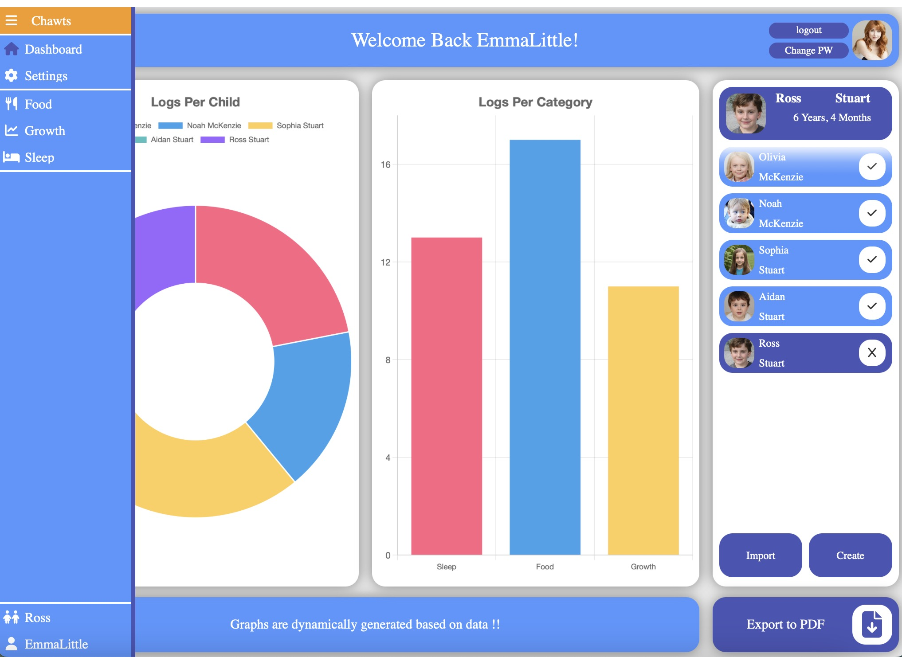

---

### 5. **Logs Per Child**
This visualization shows the number of logs associated with each child.

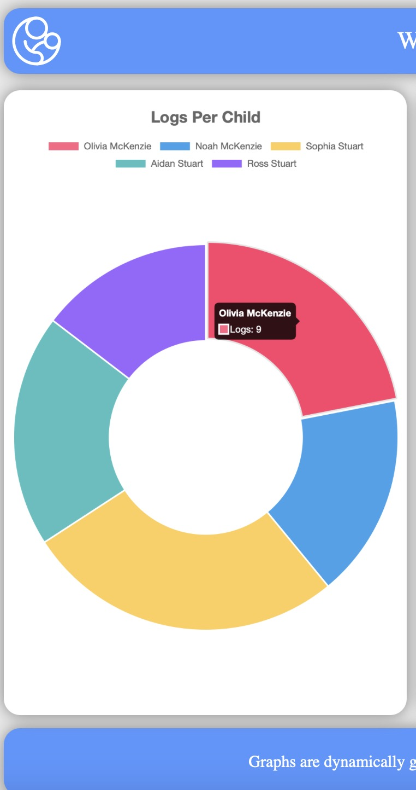

---

### 6. **Logs Per Category**
Displays logs categorized into sleep, food, and growth metrics.

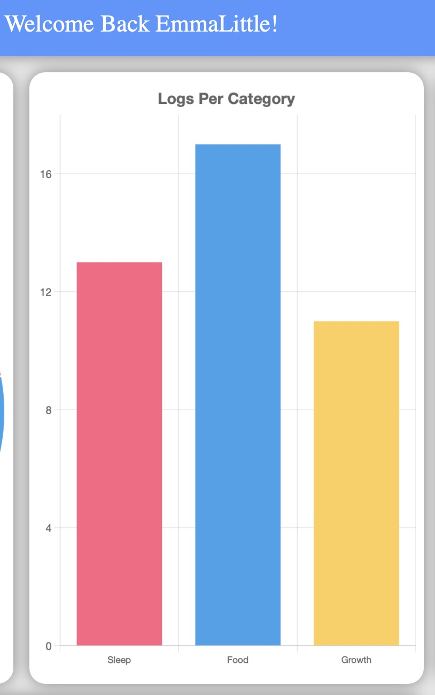

---

### 7. **Forgot Password Workflow**
Users who forget their password can reset it via email.

- Clicking **'Forgot Password?'** redirects to the password reset page.

  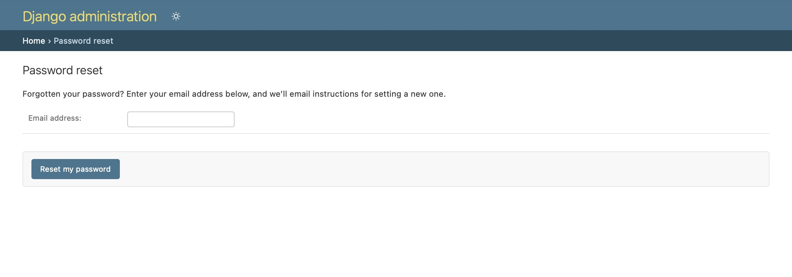
  
- Users then enter their email address to receive reset instructions.

  

---

### 8. **Change Password Page**
Users can change their password securely by entering their old and new passwords.

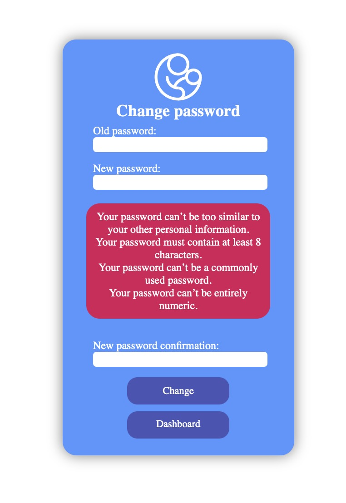

---

### 9. **Create New Child Profile**
Users can add a new child profile by entering details such as name and date of birth.

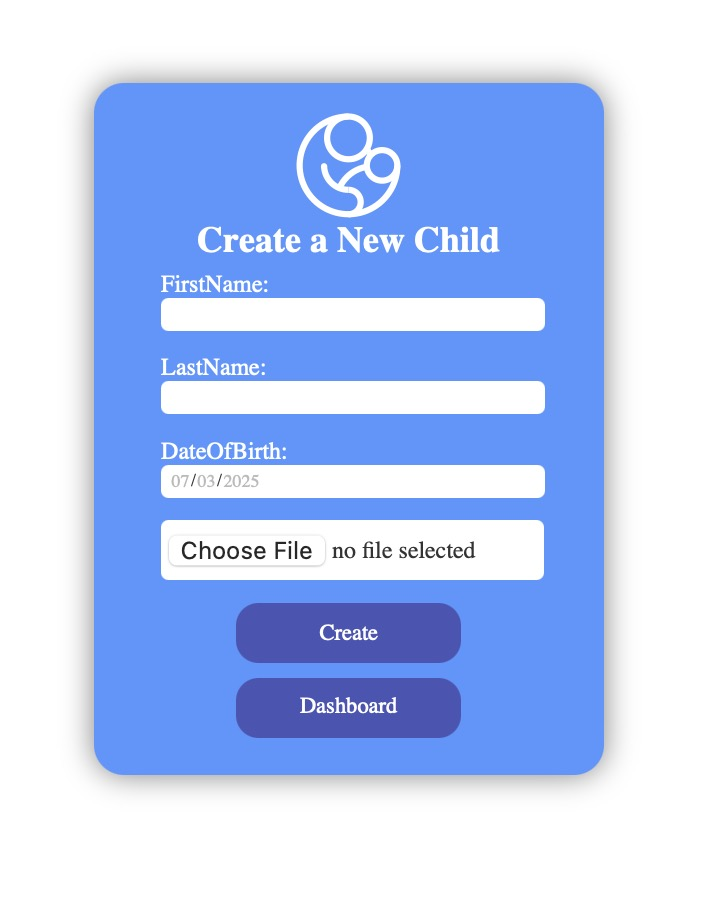

---

### 10. **Import Child Profile**
Users can import child data using a unique share code.

---

### 11. **Selected Child Panel**
Users can select or deselect children for tracking.

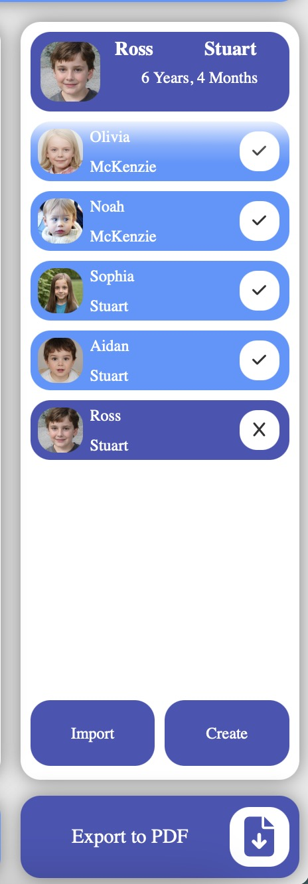

---

### 12. **Food Tracking**
Users can log meal times, meal types, and calories consumed.

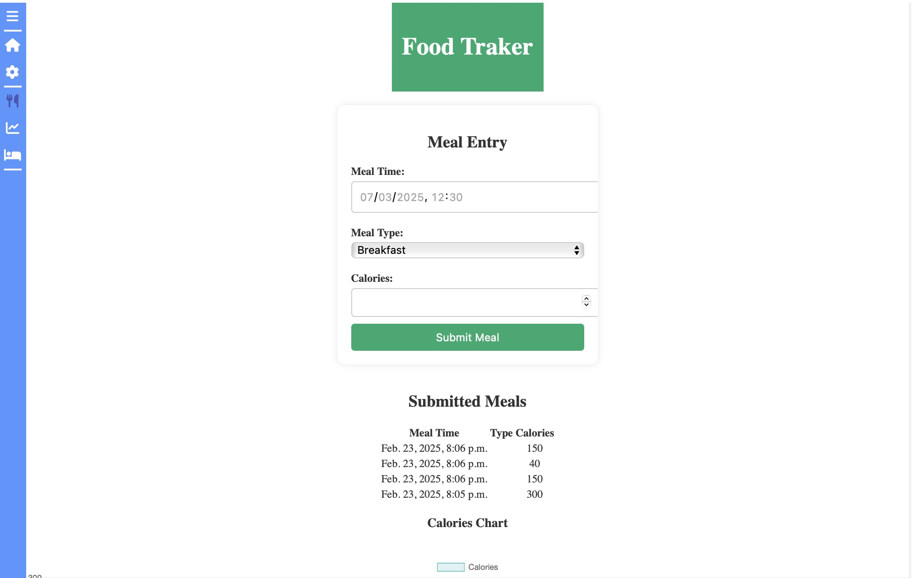

- **Graph Representation:** Displays calorie intake trends over time.

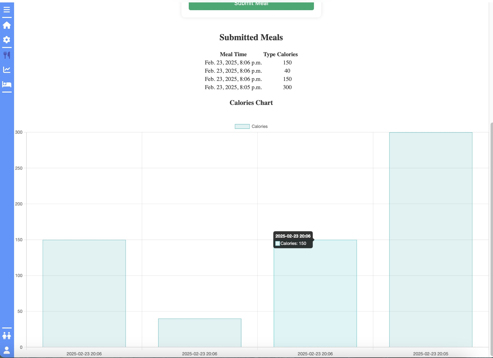

---

### 13. **Growth Tracking**
Users can log a child's **height, weight, and head circumference** over time, with detailed graphical representation and historical data.

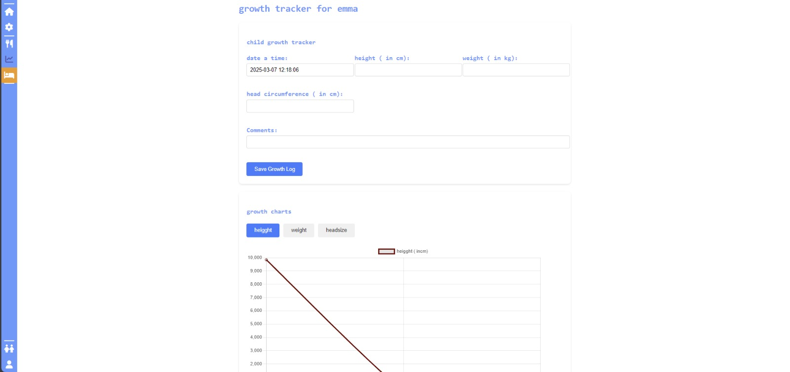

- **Growth Chart & History:** Displays logged data over time for comparison.

---

### 14. **Medication Tracking**
Users can log their child’s medication schedule, including dosage, frequency, and time.

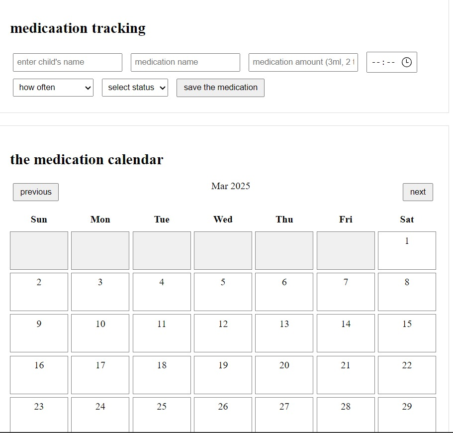

- **Medication Records:** A table view of all logged medications.

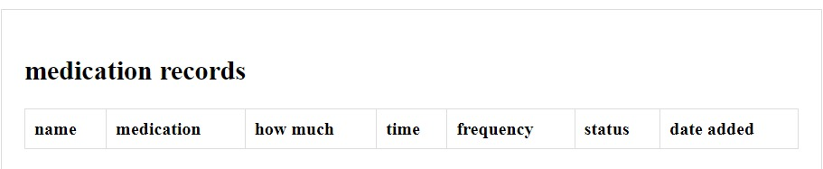

---

### 15. **Sleep Monitoring**
Tracks sleep duration and patterns with visual insights into quality and sleep schedule.

.jpg)

---

### 16. **Export Data as PDF**
Users can export their child's health data as a PDF for consultations.

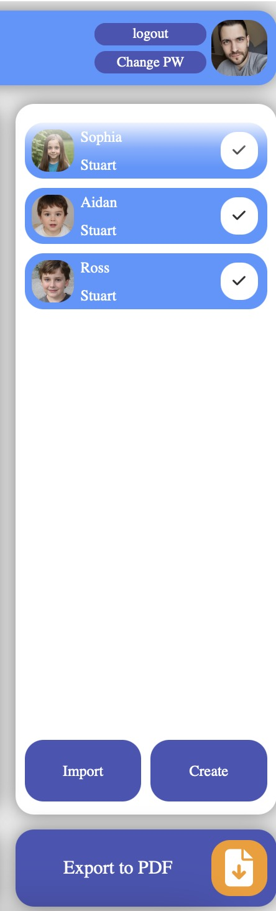

- **Exported PDF Sample:**

  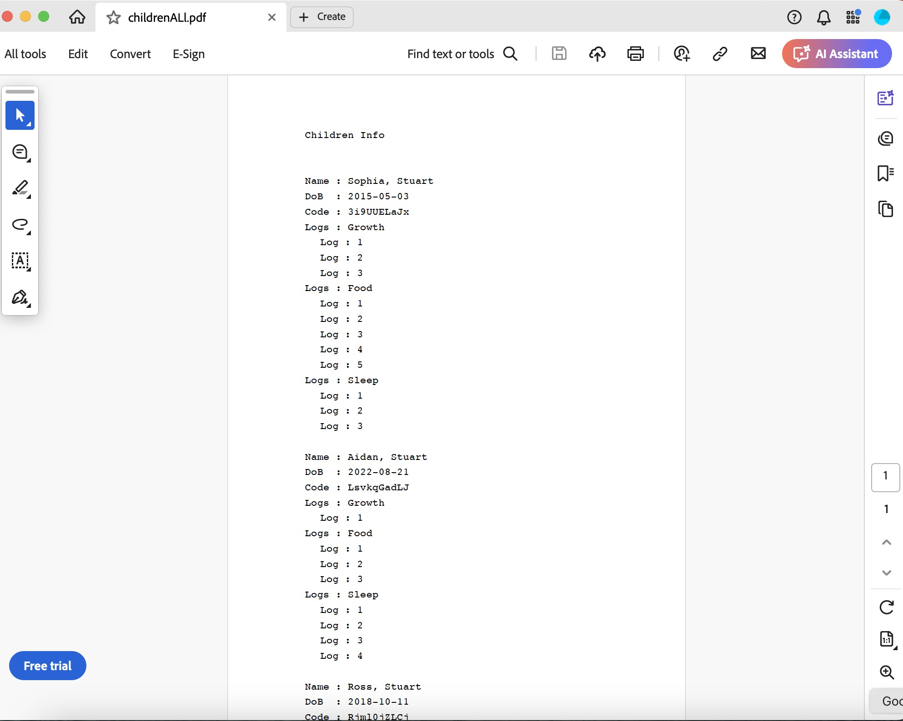

---

### 17. **Settings Panel**
Users can manage their account settings, update security options, and change appearance.

.jpg)

---

## Conclusion
The software provides an intuitive and efficient solution for tracking child health and well-being. With its user-friendly interface, dynamic data visualization, and reporting capabilities, it equips caregivers and parents to make informed decisions regarding their child’s health.