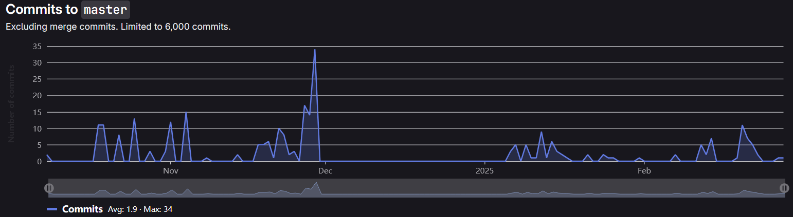
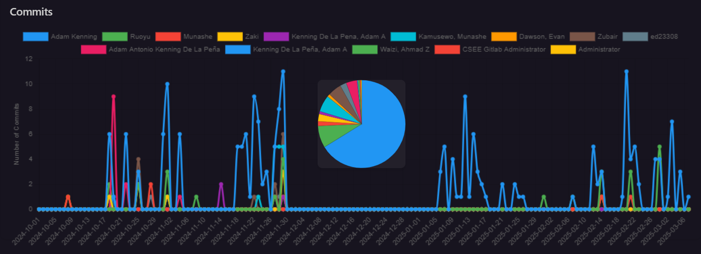
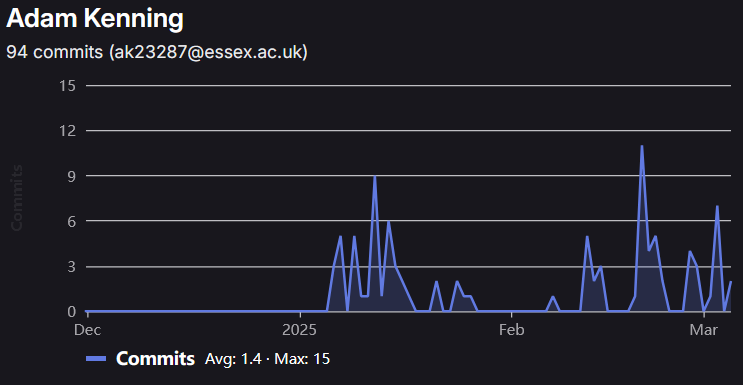
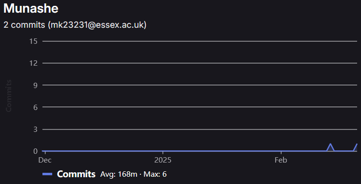
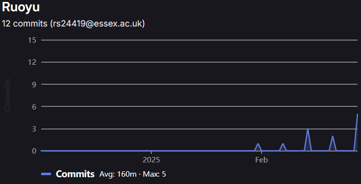
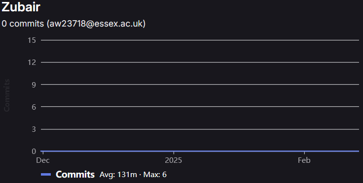
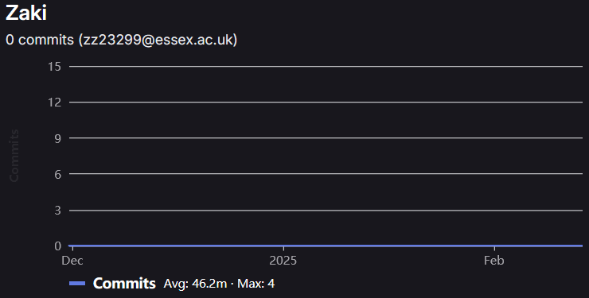
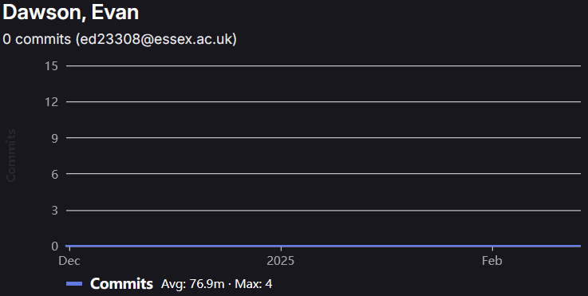

## Team member name Ruoyu Sun(Charles):
### Sprint 8 (University Week 18):
https://ce201-team02.atlassian.net/browse/SCRUM-88
https://ce201-team02.atlassian.net/browse/SCRUM-96
https://ce201-team02.atlassian.net/browse/SCRUM-102

Now that we have completed the MVP, the product needs further work to be fully functional.
Django is the main tool we are going to use, so this week our team focused on getting Django up and running.
Also we plan to start by setting up a virtual environment on our laptops, allowing each of us to work on our individual parts and eventually merge them.
By working on our own branches, we can ensure that others cannot interfere with our work, and it is easy for me to complete this task. It took 30 minutes.

### Sprint 9 (University Week 19):
https://ce201-team02.atlassian.net/browse/SCRUM-115
https://ce201-team02.atlassian.net/browse/SCRUM-108

As we began working on the implementation for this project, our main task this week was to familiarize ourselves with Chart.js, which we plan to use for creating charts and graphs. We also attempted to integrate it into our project as a test. It took 1 hour.
Alongside this, we also need to address the errors in the front end from the MVP, as it is not functioning optimally. We plan to refine it and convert it into the appropriate backend format.

### Sprint 10 (University Week 20):
https://ce201-team02.atlassian.net/browse/SCRUM-130

This week, I continued working on my assigned page, the food page.
Additionally, I was tasked with figuring out how to export a PDF for a specific child, including all the relevant information. It took me about an hour to discover.

### Sprint 11 (University Week 21):
https://ce201-team02.atlassian.net/browse/SCRUM-144
https://ce201-team02.atlassian.net/browse/SCRUM-150

This week, I worked on converting the food page to the backend, making the charts function dynamically.
After saving the data, the table is automatically updated, and a line chart is generated to visualize the food intake. It took 2 days during this week.

### Sprint 12 (University Week 22):
https://ce201-team02.atlassian.net/browse/SCRUM-155

As we only have two weeks left before the deadline, we need to start working on the report.
I chose to write the Product Context Report section, but I haven’t finished it this week.
Additionally, some errors still exist, so we need to fix them and try to make it looks better.

### Sprint 13 (University Week 23):

During this week, I finished my report by Thursday. Our team will meet on Friday to fix any remaining issues and upload the final product.

## Team Member : Munashe

### Sprint 8 (University week 10)
https://ce201-team02.atlassian.net/browse/SCRUM-82

In this scrum we were meant to get the virutal machine working so that all of us as a group can work together on one things, when we started we were struggling using github, it would take quite some time for things to go through when typing the ocde and a lot of the time things would freeze, so we decided to then used visual studio code, we went on csee gitlab and then copied the https link and then i went a cloned the git repository. And after that as a group we where then able to start working together.

https://ce201-team02.atlassian.net/browse/SCRUM-83

In this scrum we had to get django working, which was quite complicated to do howeer i had help from my team members who are more knowledgeable in the the area about visual studio code and python etc.

https://ce201-team02.atlassian.net/browse/SCRUM-84

For this we had to run the server on our devices so we can make improvemtns and see how it would look for the final product.
What we had:
## deactivate virtual environment if currently in one

if ($env:VIRTUAL_ENV) {

    deactivate

}

Write-Host "[1/3] Starting Virtual Environment..."

set-Location (Split-Path $MyInvocation.MyCommand.Path) # set location to wherever this file is

. .\venv\Scripts\Activate

Set-Location djangoProject

Write-Host "[2/3] Applying Migrations..."

python manage.py migrate *> $null

Write-Host "[3/3] Starting the Server..."

python manage.py runserver

When i run this this is what i get in the terminal:
March 04, 2025 - 14:36:49

Django version 5.1.6, using settings 'djangoProject.settings'

Starting development server at http://127.0.0.1:8000/

I can then click on the link and it will then take me to the website.

### Sprint 8 – 9 (university week 17)
https://ce201-team02.atlassian.net/browse/SCRUM-110

For this i went on the chart.js to look up on how to make a line graph to show the child development over time i idid find this quite difficult to know how to do this. However i then found a website where i can do this and for this i also made a tab where it will be a weight height and head size. Where the user can switch between where they want to see.
https://ce201-team02.atlassian.net/browse/SCRUM-91

For this i had to go back to my page and make sure that everyhintg works as it should and that i should be optimizing my code before i start working on how to figure out how to the database stuff. For this i was making sure that i was checking the spelling of the things in my page, seeing ways in which i can make my code simpler and easier to read. And testing things out so that they work.

### Sprint 10 (university week)

https://ce201-team02.atlassian.net/browse/SCRUM-128
for this i had to make a medication page. On this page the user can select which child is taking which medicine. On the page there would be input boxes for the parents or caregivers where they can put the medication name how much they are taking like dosage where its 5 ml or like 2 tables. I also had a place for how many time are they taking the medication in a day and what time they are doing it so that they can keep track. I also added a status if the medication has been completed or they are not using it anymore. And there was also a date added slot so they can keep track. I also added a calendar so the adult can look back and see what medication they have taken or time.

### Sprint 11 (university week)

https://ce201-team02.atlassian.net/browse/SCRUM-126
https://ce201-team02.atlassian.net/browse/SCRUM-127

For this i had to finalize my page fully, this is that part the i struggled with a lot i  am not that good with programming so i struggled a lot with this one. I was able to finish the html part of my website. Then there was the more difficult part of  connecting it to the database this is the part that i struggled with the most because i had no knowledge in this area, however i had teammates who did know, so the assisted me with it. When i go to the improved page it links with the database so when i add a child on the main page it then links with the my growth page. Next i had to work on a medication page this was i page that i wa interested in doing but it was not that far off from my own page, so that was a lot that i could bring over to make things easier.

### Sprint 12 (university week)

https://ce201-team02.atlassian.net/browse/SCRUM-156

For this scrum i had to write a report on the product and i chose to do the marketing side of it. For this i had to write a marketing plan, i inlcuded things like the customers, what demographic is most likely to  purschase / donwload  our application. I then had to touch on the economics side of it.  like what is the total size of the market. How much of the market can we have when we release our application. And what is the current demand in the space that we are in. And the trend like what are other apps doing that make the popular. I also took a look at other apps like i did before where i looked for ideas on wha makes  a growth tracker good, this time i was looking at what our app does better than those ones on the market. For the last part i had to make a sales forecast for how well our app will do. however last minute changes were made in the database py area, so im not sure if my medication page works well.s

## Zaki Hamdan

### Sprint 8 (University Week 18):

In week 18, I managed to get my virtual environment and Django working on my personal computer. Figuring out how to get Django working on macOS turned out to be hassle to deal with and took much longer than expected to get running. it took around 45 mins to get it done
https://ce201-team02.atlassian.net/browse/SCRUM-85

https://ce201-team02.atlassian.net/browse/SCRUM-97

### Sprint 10 (University Week 20):

In week 20, I added a feature where a user can change the colour of their screen in case the user is colourblind and unable to differentiate between certain colours. It took a few hours to complete this task.
https://ce201-team02.atlassian.net/browse/SCRUM-129

# Team Effort

Team Effort log for MVP : [24-25_CE201-col_team02\MVP\TeamEffortLog.md](C:\Users\calis\Desktop\24-25_CE201-col_team02\MVP\TeamEffortLog.md)

## Contribution Metrics

| Name | ID | Contribution Percent | Commits Total | Commits since MVP |  Commits during MVP |
| ------- | ------- | ---: | --: | --: | --: |
| Adam    | ak23287 |  71% | 209 |  94 | 115 |
| Munashe | mk23231 |   8% |  23 |   2 |  21 |
| Charles | rs24419 |   8% |  23 |  12 |  11 |
| Zubair  | aw23718 |   6% |  17 |   0 |  17 |
| Zaki    | zz23299 |   4% |  11 |   0 |  11 |
| Evan    | ed23308 |   3% |  10 |   0 |  10 |
| Admin   |         |   1% |   2 |   0 |   2 |
| Total   |         | 100% | 295 | 108 | 187 |

### Whole Team Commit Graph

**As a collective** : Source (GitLab)

**As Individuals** : Source (VScode)

### Individual Commit Graphs (MVP Submission - Present)

## Adam Antonio Kenning De La Peña

### Christmas Holiday

1. Scrum 75 - 6 Hours
    - Jira <https://ce201-team02.atlassian.net/browse/SCRUM-75>
    - Commit fb29901ce934957a151666cda7f505152a5d8c86
    - Setup a functional backend for the website to be hosted on
2. Scrum 78 - 2 Hours
    - Jira <https://ce201-team02.atlassian.net/browse/SCRUM-78>
    - Commit 32257b9e8feedfb18c7cfc181f6a76b75adc1389
    - Migrate all pages, and static files over to new backend
3. Scrum 79 - 2 Hours
    - Jira <https://ce201-team02.atlassian.net/browse/SCRUM-79>
    - Commit 7564ed819633625cbeadd0ad87c40cf5557b1e51
    - Fix broken pages caused by migration
4. Scrum 80 - 2 Hours
    - Jira <https://ce201-team02.atlassian.net/browse/SCRUM-80>
    - Commit b53fef4935535c4649b4e58736882bcffba2b71d
    - Setup user management system

### Sprint 8 (University Week 17)

1. Scrum 82 - 1 Hours
    - Jira <https://ce201-team02.atlassian.net/browse/SCRUM-82>
    - Commit None
    - Setup Virtual Environment Working for everyone else
2. Scrum 83 - 1 Hours
    - Jira <https://ce201-team02.atlassian.net/browse/SCRUM-83>
    - Commit None
    - Setup Django Working for everyone else
3. Scrum 84 - 1 Hours
    - Jira <https://ce201-team02.atlassian.net/browse/SCRUM-84>
    - Commit None
    - Get the server Running for everyone else

### Sprint 9 (University Week 18)

1. Scrum 104 - 1 Hours
    - Jira <https://ce201-team02.atlassian.net/browse/SCRUM-104>
    - Commit 53e5be2de0efbe446fc72a3487394adcfa3316e4
    - Fix any errors on assigned front end page
2. Scrum 111 - 1 Hours
    - Jira <https://ce201-team02.atlassian.net/browse/SCRUM-111>
    - Commit 649828702742b28889732fb2e94b759c9d954b07
    - Familiarize with Chart.js
3. Scrum 117 - 2 Hours
    - Jira <https://ce201-team02.atlassian.net/browse/SCRUM-117>
    - Commit ca984b571ac83952ed70920b6bb3f54e7f75a771
    - Implement Child functionality

### Sprint 10 (University Week 19)

1. Scrum 124 - 2 Hours
    - Jira <https://ce201-team02.atlassian.net/browse/SCRUM-124>
    - Commit ca984b571ac83952ed70920b6bb3f54e7f75a771
    - Implement Logs functionality

### Sprint 11 (University Week 20)

1. Scrum 125 - 2 Hours
    - Jira <https://ce201-team02.atlassian.net/browse/SCRUM-125>
    - Commit 33a969b251028110fa5cd45d679810266077dd9c
    - Implement Export functionality
2. Scrum 140 - 1 Hours
    - Jira <https://ce201-team02.atlassian.net/browse/SCRUM-140>
    - Commit 649828702742b28889732fb2e94b759c9d954b07
    - Link charts.js with backend Logs
3. Scrum 146 - 1 Hours
    - Jira <https://ce201-team02.atlassian.net/browse/SCRUM-146>
    - Commit e568c7503ee8f81e7d2e953306a2620e2bd9b936
    - Finalize front end pages
4. Scrum 152 - 0.5 Hours
    - Jira <https://ce201-team02.atlassian.net/browse/SCRUM-152>
    - Commit 33a969b251028110fa5cd45d679810266077dd9c
    - Scale back project (Diaper, Emotion) (Medication page later returned)
5. Scrum 153 - 0.5 Hours
    - Jira <https://ce201-team02.atlassian.net/browse/SCRUM-153>
    - Commit 5f1c464939e7f0b7a0fda0581cf575a740d08dc7
    - Write requirements.txt
6. Scrum 154 - 0.5 Hours
    - Jira <https://ce201-team02.atlassian.net/browse/SCRUM-154>
    - Commit 8d68694342091a6dff2f0fe04f2316be85a7e75d
    - Add automated setup (For lecturer marking)

### Sprint 12 (University Week 21)

1. Scrum 138 - 1 Hours
    - Jira <https://ce201-team02.atlassian.net/browse/SCRUM-138>
    - Commit 59f13936ae49e902f94cfe924365fa0d440dc74b
    - Create example data dataset
2. Scrum 139 - 0.5 Hours
    - Jira <https://ce201-team02.atlassian.net/browse/SCRUM-139>
    - Commit 59f13936ae49e902f94cfe924365fa0d440dc74b
    - Write about.txt (later changed to README.md)
3. Scrum 157 - 6 Hours
    - Jira <https://ce201-team02.atlassian.net/browse/SCRUM-157>
    - Commit c0d96f1ba6475a5baac471325d90fede22c44df2
    - Write implementation report

### Sprint 13 (University Week 22)

1. Scrum 162 - 0.5 Hours
    - Jira <https://ce201-team02.atlassian.net/browse/SCRUM-162>
    - Commit 058b817d1e5d9f6863a8f4bb61eef911e47c9f0a
    - Hot fix export functionality
2. Scrum 164 - 0.5 Hours
    - Jira <https://ce201-team02.atlassian.net/browse/SCRUM-164>
    - Commit 30f02c4bb1da85aa10c3f1531aa4f17df465df8d
    - Hot fix changeProfile CSRF security token session error
3. Scrum 165 - 0.5 Hours
    - Jira <https://ce201-team02.atlassian.net/browse/SCRUM-165>
    - Commit 84c2d1daf2d11f6f19e2e5933079d19a73620edb
    - Link back in medication page
4. Scrum 163 - 1 Hours
    - Jira <https://ce201-team02.atlassian.net/browse/SCRUM-163>
    - Collate project branches / documentation ready for submission
    